# Welcome!

## About Me
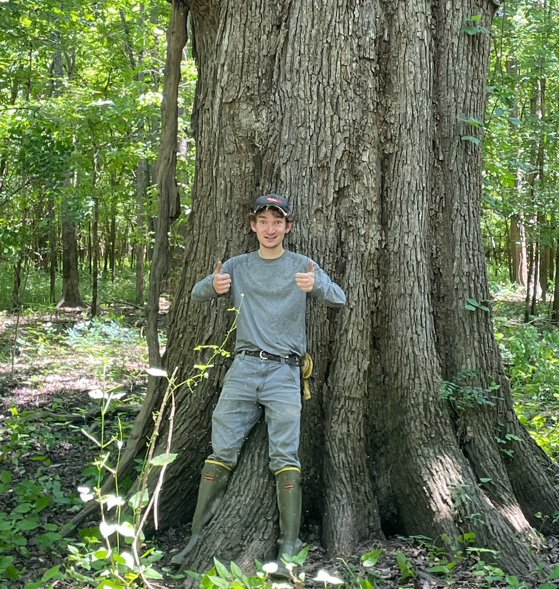
I am a Project Manager for the Balch Fire Lab and The North Central Regional Invasive Species and Climate Change ([NC RISCC](https://nc-riscc.org/)). Prior to joining the Balch Fire Lab, I worked at the National Ecological Observatory Network (NEON) as a botanist in the [Southeast US](https://www.neonscience.org/impact/observatory-blog/getting-know-neon-domains-ozarks-complex). My previous research focused on assessing genomic variation and habitat suitability for the invasive species Johnsongrass (*Sorghum halepense*). I received my MS in Biology from the University of Alabama, and my BS in Evolution and Ecology from Ohio State University.

## Data Exploration
Below are assignments from the CU Boulder Earth Analytics Data Science Course

### Chicago Urban Greenspace and Chronic Obstructive Pulmonary Disease (COPD) Prevalence
See the code used to generate these figures [here](portfolioPosts/CDC_portfolioPost.html)!

#### Background
Chronic Obstructive Pulmonary Disease (COPD) is a lung condition characterized by inflammation of the airways, limiting airflow to the lungs. The most common cause of COPD is long-term exposure to irritating smoke, fumes, dust, and chemicals ([Mayo Clinic](https://www.mayoclinic.org/diseases-conditions/copd/symptoms-causes/syc-20353679)).

Because COPD can be caused by environmental exposure, I was curious about the spatial incidence across an urban area like Chicago. Investigating some of the literature relating COPD to greenspace, I found contrasting evidence suggesting there are region-specific relationships between COPD incidence/mortality and greenspace.

One study conducted across Chongqing, China found township-specific relationships between COPD mortality and greenspace. Despite evidence that greenspace can reduce the incidence of lung disease ([Li et al., 2019](https://www.mdpi.com/1660-4601/16/6/991)), this study found that in some regions, COPD related mortality was positive correlated with greenspace ([Gou et al., 2023](link.springer.com/article/10.1186/s12890-023-02359-x#ref-CR10)). Gou et al pointed out that these regions were typically more rural, and thus increased COPD mortality could be due to lack of access to medical treatment rather than as a result of greenspace. 

Another study conducted by [Maas et al., 2009](https://jech.bmj.com/content/63/12/967.short) in the Netherlands show that COPD and asthma (and other indicators of health) are lower in areas with higher greenspace.

Given the highly regional and context specific trends for COPD incidence and greenspace, I was curious to examine their relationship in Chicago.

#### Methods
I downloaded Chicago census trancts and joined them to 2023 COPD data from the [CDC PLACES dataset](https://www.cdc.gov/places/tools/data-portal.html). These data show % COPD incidence within each transect. I downloaded aerial imagery from the [National Agriculture Imagery Program (NAIP)](https://naip-usdaonline.hub.arcgis.com/) through the Microsoft Planetary Computer SpatioTemporal Access Catalog (STAC). Using the spectra from this imagery, I calculated several Normalized Difference Vegetation Index (NDVI)-based measures of greenness per tract (e.g. mean patch size, fraction of vegetation, edge density).

<embed type="text/html" src="img/copd_green.html" width="600" height="600">
**Figure 1:** Comparison between adult COPD rate and vegetation edge density across Chicago census tracts.

I then performed ordinary least squares (OLS) regression on log-transformed copd rates, using log-transformed mean patch size and untransformed edge density. I used 30% of the data for training, and validated and tested using the remaing 70%.

#### Results

<embed type="text/html" src="img/copd_model.html" width="600" height="600">
**Figure 2:** Predicted vs. measured COPD prevalence using our OLS model.

Our model and the vegetation predictors (edge density and patch size) do a poor job predicting COPD rates across the city. A strong model would show a linear relationship between measured and predicted COPD prevalence. 

#### Conclusions

<embed type="text/html" src="img/copd_error.html" width="600" height="600">
**Figure 3:** Spatial distribution of model prediction error across the Chicago transects.

**Spatial distribution of error**
We underestimate COPD rates in south and western areas of the city, and over estimates in the northern and central parts. This pattern mirrors the spatial distribution of COPD rates in the city, seen in our map plotting the raw PLACES data on the city. 

**How to improve these results**
It seem that our model has some degree of spatial autocorrelation that we aren't accounting for. We could start by adding latitude and longitude as predictor variables as a way of explaining some of the variation we're seeing. If these issues persist, we could pivot to a model like geographically weighted regression, which can help account for the non-stationarity we're seeing in our data [(Columbia, Mailman School of Public Health)](https://www.publichealth.columbia.edu/research/population-health-methods/geographically-weighted-regression).


### Mapping Greater sage-grouse occurrence across BLM Habitat Management Areas (HMAs)
The Greater sage-grouse (*Centrocercus urophasianus*) is a threatened species endemic to the sagebrush steppe ecosystem of Western North America [(Prochazka et al., 2025)](https://pubs.usgs.gov/publication/dr1217). The Bureau of Land Management (BLM) manages the largest share of Greater sage-grouse habitat in the United States, a total of 65 million acres [BLM, 2024](blm.gov/programs/fish-and-wildlife/sage-grouse). I investigated Greater sage-grouse occurrence patterns across BLM land using Global Biodiversity Information Facility (GBIF) data to assess if high occurrence was associated with high-priority BLM habitat. See the full code workflow [here](https://natshoff.github.io/portfolioPosts/centrocercusUrophasianus_portfolio_final.html)

#### Who is the Greater sage-grouse?
<iframe width="560" height="315"
        src="https://www.youtube.com/embed/Sh5EOGeP540?si=CMtNZHlpnSPMEhwp"
        title="YouTube video player" frameborder="0"
        allow="accelerometer; autoplay; clipboard-write; encrypted-media; gyroscope; picture-in-picture"
        allowfullscreen>
</iframe>
Male Greater sage-grouse maintain mating territories called "leks" [(Rathor et al., 2023)](https://pmc.ncbi.nlm.nih.gov/articles/PMC9939265/), and display the behavior "lekking" shown in the video above during mating season.

Sage-grouse are sagebrush obligates that depend on sagebrush for food, cover, and mating grounds. These birds are an indicator species for other sagebrush obligates like the pygmy rabbit, sagebrush vole, sage thrasher, and sage sparrow [(USGS, 2011)](https://www.usgs.gov/publications/chapter-2-sagebrush-associated-species-conservation-concern). Sagebrush habitat is being lost to development, invasive grass spread, and woody encroachment. Habitat loss has led to Greater sage-grouse populations declining by 78.8% since 1960 [(Prochazka et al., 2025)](https://pubs.usgs.gov/publication/dr1217). 

#### How do BLM HMAs work?
It's more confusing than you might initially guess. BLM organizes Greater sage-grouse land into Habitat Management Areas (HMAs) based on **regional** Environmental Impact Assessments (EIS), which are assigned a **habitat type** based on the quality of the land and intended management actions. Different BLM **regions** use different **habitat-type** verbiage to describe the goals of their HMAs. 

Here is how the BLM divides regional HMAs:
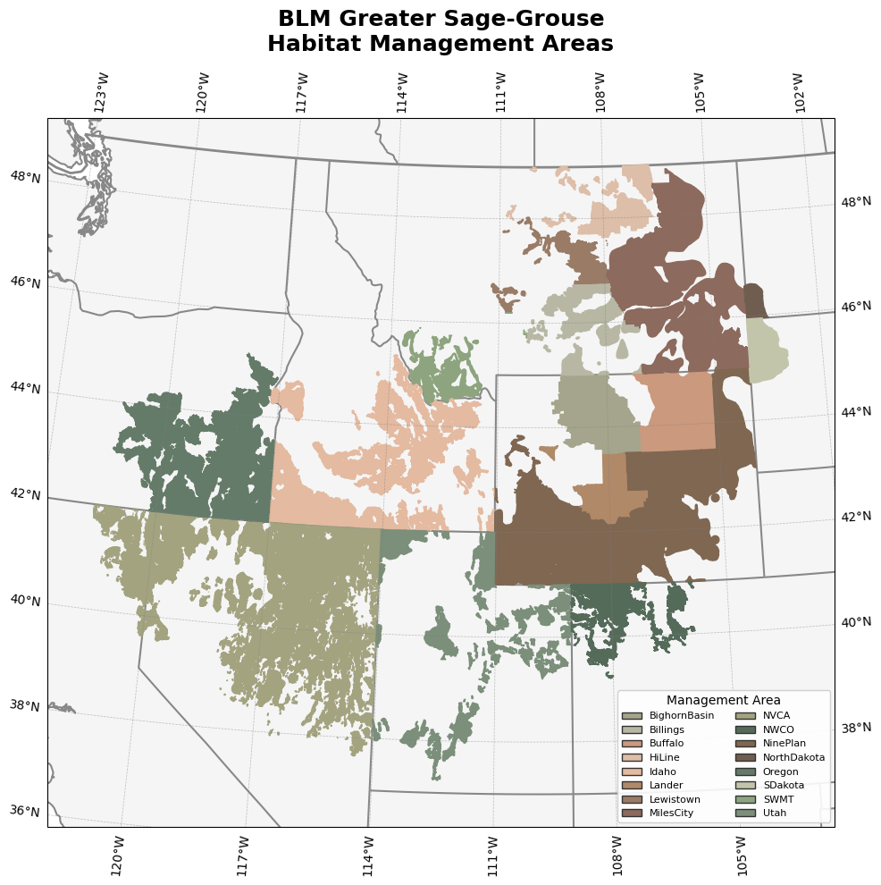
***Figure 1:*** BLM HMAs colored by region.

Below is a table with the different assigned **habitat types** and my interpretation of their relative priorities based on nationwide BLM language [(BLM, 2020)](https://eplanning.blm.gov/public_projects/2016719/200502020/20050224/250056407/Greater%20Sage-Grouse%20Five-year%20Monitoring%20Report%202020.pdf?_gl=1*15cchyn*_ga*MTE2MzA5NzIxLjE3NTQzMjgyMTU.*_ga_GQKKTMMT8V*czE3NjUzODg2MDMkbzI3JGcxJHQxNzY1Mzg4NjY4JGo2MCRsMCRoMA..). **Important note:** these are not BLM-sanctioned "priorities", rather they are my attempt to simplify a multitude of acronyms and are inferred from reading through BLM Greater Sage-Grouse Habitat Management Area State-by-State Mapping Strategies.

**Habitat Types in our data**

| Acronym | Full Name | Region of Use | Assigned Priority Tier |
| ------- | --------- | ------------- | ---------------------- |
| PHMA | Priority Habitat Management Area | Range-wide | High |
| IHMA | Important Habitat Management Area | ID, MT | High |
| AM | Anthro Mountain Habitat Management Area | UT | High |
| GHMA | General Habitat Management Area | Range-wide | Medium |
| LCHMA | Linkage and Connectivity Habitat Management Area | CO | Medium |
| RHMA | Restoration Habitat Management Area | MT, ND, SD | Low |
| OHMA | Other Habitat Management Area | NV, CA | Low |

***Table 1:*** BLM habitat type designations (acronyms), the regions these terms are applied to, and their assigned priority tier generated by looking at the nationwide BLM Greater sage-grouse management plan [BLM, 2024](https://www.blm.gov/programs/fish-and-wildlife/sagegrouse/blm-sagegrouse-plans/2024-habitat-management-areas).

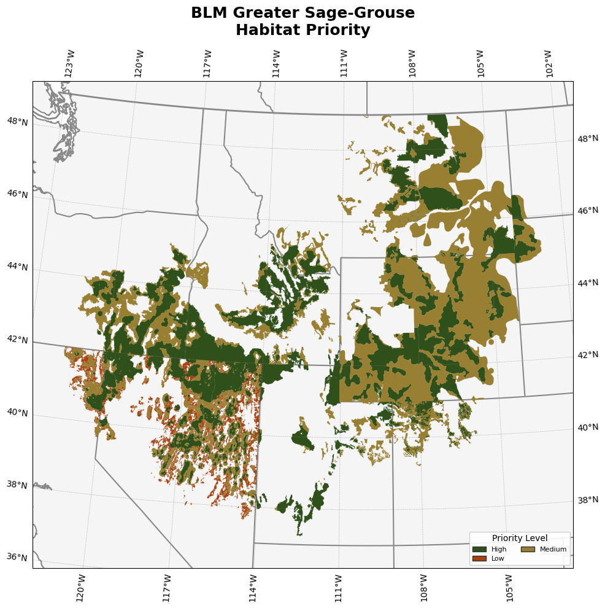
***Figure 2:*** BLM HMAs colored by **my** assigned priority.

Mapping low, medium, and high priority areas reveals a distinct spatial pattern in habitat priority. Nevada and northeastern California have the highest amount of "low quality" habitat. In BLM-speak, these areas are "Other Habitat Management Area," where either (1) there is little information known about Greater sage-grouse habitat, or (2) the habitat is degraded in quality [BLM, 2015](https://eplanning.blm.gov/public_projects/2016719/200502020/20122939/251022919/Appendix_03_GRSG_HMA_Strategy_Summaries_508.pdf#:~:text=Priority%20habitat%20(PHMA)%20includes%20areas%20with%20relatively,maintaining%20the%20extent%20of%20the%20GRSG%20range.). This region of the Great Basin faces challenges in habitat loss from both increasing invasive annual grasses [(Roche et al., 2024)](https://www.sciencedirect.com/science/article/pii/S0190052824000774?) and land use conversion (e.g. energy, pastures, mining) [(Conover & Roberts, 2016)](https://www.jstor.org/stable/24874178?seq=1), which impact the quality of Greater sage-grouse habitat.

#### GBIF occurrence data
I queried GBIF for all Greater sage-grouse observations between 2015 and 2024. Examining the raw yearly occurrence data reveals increasing yearly observations and "hotspots" where there are consistently high observations (Figure 3). 

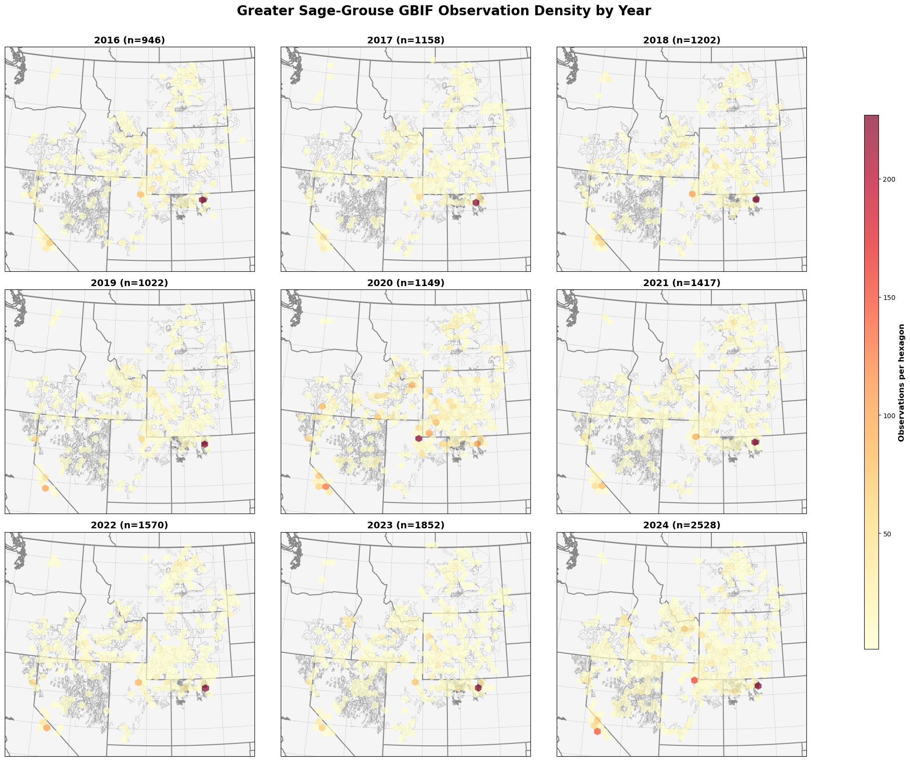
***Figure 3:*** Raw number of GBIF observations (colored hexagons) across BLM management areas (light grey outlines).

#### Let's normalize
I calculated a normalized occurrence value for each HMA and year to account for changes in yearly increases in the number of Greater sage-grouse observations and the hotspots we saw in the raw data. 

```
# Normalize by space and time for sampling effort
occurrence_df['norm_occurrences'] = (
    occurrence_df[['density']]
    / mean_occurrences_by_year[['density']]
    / mean_occurrences_by_hma[['density']]
)
```

Normalization will help us account for both variation in the number of occurrence records per year and the size differences between the different areas. Both are shown here summed by priority level instead of HMA.

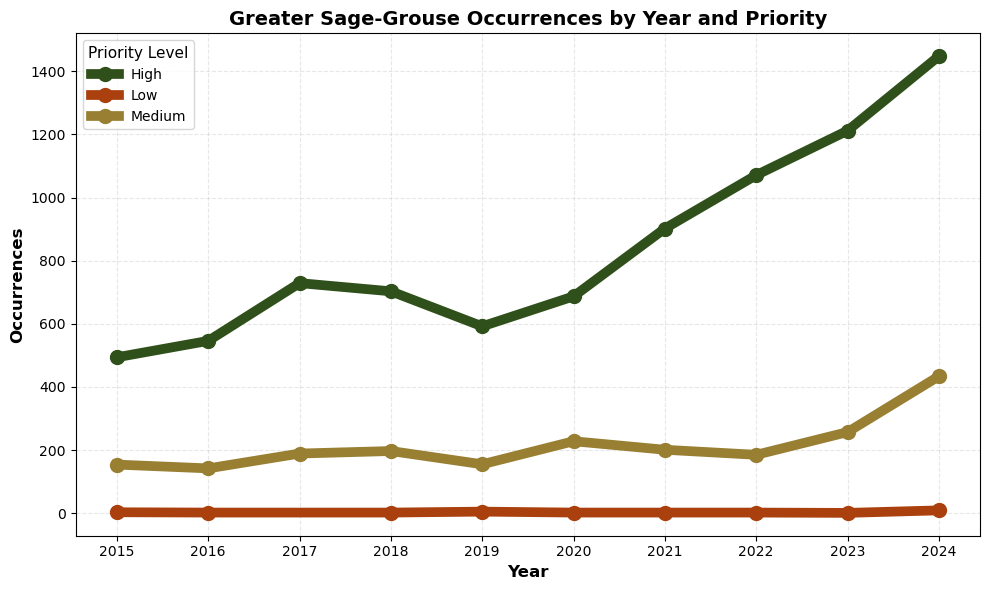
***Figure 3:*** Number of GBIF observations for HMAs between 2015–2024.

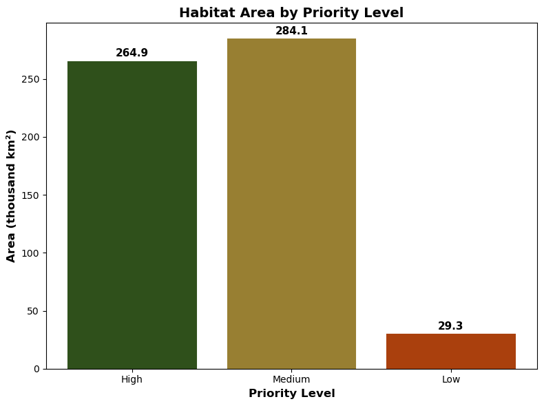
***Figure 4:*** Size comparison between low-, medium-, and high-priority HMAs.

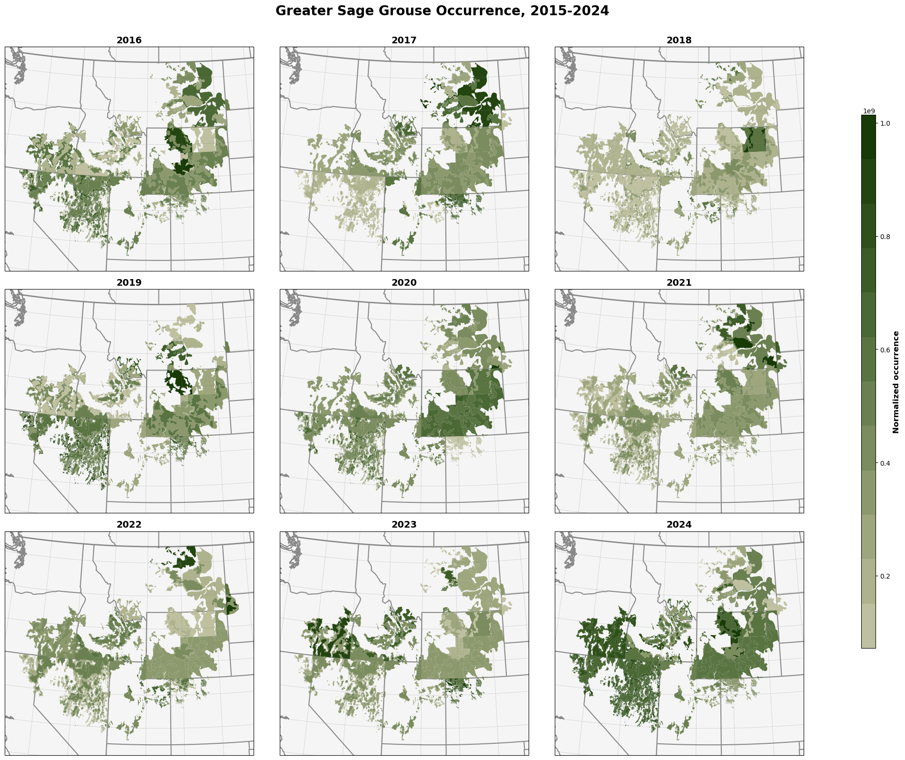
***Figure 5:*** Normalized occurrence data for each BLM HMA between 2016 and 2025. Note: remember the "low" priority areas are located along the edges of the BLM HMAs in Nevada. Scroll up to figure 2 for a reference. 

We see substantial variation in occurrence across the HMAs year-to-year. Generally, we see higher occurrence in the higher-priority, core Wyoming habitat, but this is not consistent throughout the record. The absence of a clear pattern could suggest our normalization is not accounting for the skewed nature of our data (higher observations in later years, hotspot near Coalmont, CO). It could also reflect variation in ease of access for sampling Greater sage-grouse. Sagebrush habitat can be extremely remote and most GBIF observations come from citizen science platforms like eBird and iNaturalist; our sampling here is not even across the sagebrush. It should also be noted that the Greater sage-grouse is non-migratory and thus using raw occurrence data here could include duplicate observations of the same individuals. 

#### In conclusion, there's more work to do
Our normalization approach did not reveal a clear pattern of Greater sage-grouse occurrence on BLM land. Further investigation into using citizen-science-gathered non-migratory bird data could reveal better methods for normalizing these data. Using a different data source, such as a Sagebrush Conservation Design core/growth habitat, could reveal more ecologically meaningful occurrence trends compared to jurisdictional areas drawn by the BLM. Unfortunately/fortunately, the data currently leave more questions than answers!

### Gila River Region – Agricultural NDVI
The Akimel O’otham and Tohono O’odham tribes of the Gila River region in south-central Arizona had 653,500 acre-feet of water annually restored to their use in 2004 [[1]](https://www.justice.gov/enrd/indian-resources-section/gila-river-indian-community). Using remotely sensed vegetation health data from [MODIS](https://modis.gsfc.nasa.gov/data/dataprod/mod13.php) and land use from the [Annual National Land Cover Database (NLCD)](https://www.usgs.gov/centers/eros/science/annual-national-land-cover-database), I investigated the impact of this settlement on the cultivated croplands of the region. **Note:** See the code that created these figures and a deeper explanation of the methods [here](https://natshoff.github.io/portfolioPosts/vegetation-05-portfolio.html)!

#### Changing Croplands in the Gila River Region
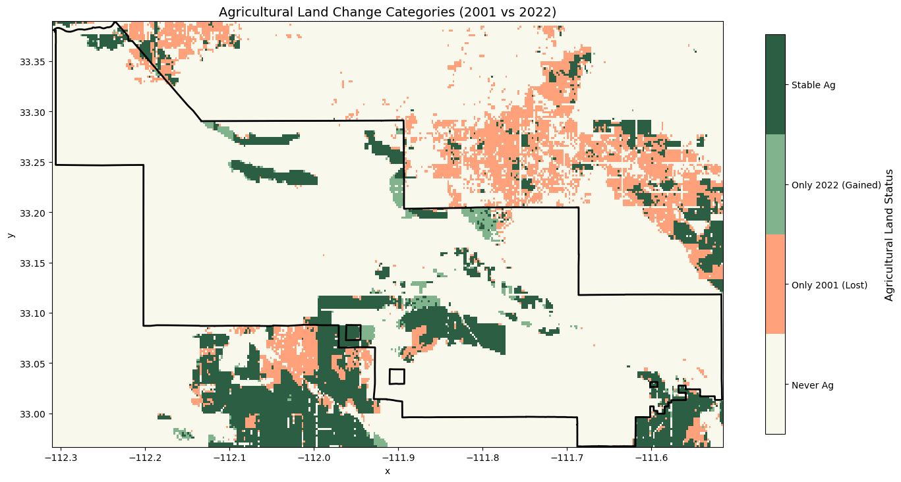
***Figure 1:** Comparing land use of cultivated crops between 2001 and 2022. Pink pixels show cropland that is only present in 2001, light green is cropland only present in 2022, and dark green represents cropland present in both 2001 and 2022. Beige areas represent non-cropland.*

#### Cropland NDVI between 2001 and 2022
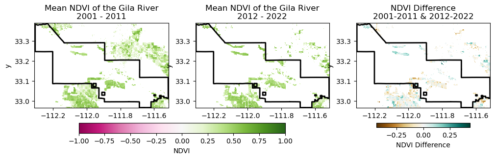
***Figure 2:** Mean NDVI for two decades, 2001–2011 (left) and 2012–2022 (center). Difference between these decades shows the change in NDVI (right).*

#### Differences in cropland NDVI between tribal and non-tribal lands
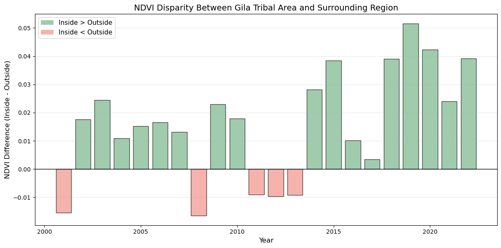
***Figure 3:** Difference in NDVI inside and outside the Gila Tribal Area. Green bars represent years where the Tribal NDVI > surrounding area, and red bars represent years where Tribal Area NDVI < surrounding area.*

#### **Conclusions**
When assessing the impact of restoring water rights to the Akimel O’otham and Tohono O’odham people, cropland NDVI tells an incomplete story. When comparing annual mean NDVI for inside the Gila Tribal lands and the surrounding area, Gila crops had a higher NDVI 17 out of 22 years for the study period (Fig. 3). This makes it seem as if there were no signals of increased plant health on Gila lands from restoring water rights. This lack of signal could instead be explained by tribal areas prioritizing water to agricultural production, both before and after winning their settlement. A better indicator of these restored rights on Gila crop production is the expanded land use when comparing 2001 and 2021 NLCD cover classes. While areas surrounding Gila **lost** cropland, Gila lands **gained or maintained** cropland (Fig. 1).

This is only part of the complicated story about the possible impact that restoring water rights has on a community. Additional analyses could focus on non-agricultural or non-irrigated land to see if these vegetation types are healthier as a result of greater access to water.

### American Golden Plover Migration Mapping
Investigating the migration patterns of the American golden plover (*Pluvialis dominica*), a bird with an ~24,000 km (~15,000 miles) long yearly migration journey [(1)](https://www.frontiersin.org/journals/ecology-and-evolution/articles/10.3389/fevo.2021.710007/full). Their southern migration route even contains a 3000–5000 km stretch of flight that is entirely over the Atlantic Ocean, meaning these birds cannot stop to rest or feed during this time [(2)](https://www.jstor.org/stable/1366605?casa_token=wtKsQEdXUHwAAAAA%3AM9SB-dQYZ8tHxZH8ErOAosejJCVK5YAF-7ZFgPzXZKqZGBY9flhzqmcCUrz53s2OdZ3rIriJK7n8rJ4yHzNZswPSChv3XFyVbuYgkGRfKBKrE2006hqF).

#### Little bird, big journey
<iframe src="https://macaulaylibrary.org/asset/31723881/embed" height="504" width="640" frameborder="0" allowfullscreen></iframe>

#### The migration of the American golden plover according to Brad Harris (Jack Black) in *The Big Year*. 
<iframe width="560" height="315"
        src="https://www.youtube.com/embed/bxygINPm5zY?start=30"
        title="YouTube video player" frameborder="0"
        allow="accelerometer; autoplay; clipboard-write; encrypted-media; gyroscope; picture-in-picture"
        allowfullscreen>
</iframe>

#### The migration patterns of the American golden plover according to the World of Birds (Cornell University).
<figure>

<figcaption aria-hidden="true">Distribution of the American Golden-Plover, per Birds of the World. Source: <a
href="https://www.allaboutbirds.org/guide/American_Golden-Plover/overview">Birds of the World</a></figcaption>
</figure>

#### The migration patterns of the American golden plover according to GBIF observations.
**Note:** See the code that created this and a deeper explanation of the methods [here](https://natshoff.github.io/portfolioPosts/pluvialisDominica_portfolio.html)!
<embed type="text/html" src="maps/pluvialisDominica_migration.html" width="600" height="800">

#### How do these three sources for migration information on the American golden plover compare?
**Birds of the World and Brad:** We can see clearly that Brad Harris and Birds of the World are on the same page. The map shows that the American golden plover spends its non-breeding overwintering time in northern Argentina and migrates through both Guatemala and Illinois on its way to breed in the tundra. 

**How does our map agree?** Our map broadly agrees! We see winter (Dec–Feb) plover observations concentrated in southern South America. Migrating birds reach the tundra by May and don't leave until August. Their overflight takes them through Guatemala and Illinois. Notably, this timing agrees with other published timings of American golden plover migration. For example, a conservation plan by [Clay et al., 2010](https://whsrn.org/wp-content/uploads/2019/02/conservationplan_amgp_v1.1._2010.pdf) notes that plovers start migrating south from their breeding habitat in late June to mid-July (these are failed breeders), with the majority of the adults leaving in August. They also note that August is the first month where birds arrive on non-breeding grounds, which also agrees with our map. There is also agreement with literature on the birds’ northern migration. Clay et al. state that birds start leaving non-breeding grounds in late January, with most leaving in February. Some birds even stick around in South America until April and May, which our map also shows. April is a major influx of birds in the Missouri, Mississippi, and Ohio River valleys. Plovers arrive on breeding grounds starting in mid-May to early June, which our maps clearly show. 

**How does our map disagree?** Our map is possibly overestimating the range of the American golden plover. You can see that the overwinter observations of the plover (see January) extend all the way to the southern tip of South America. It is certainly possible that some birds migrate this far south, but our map might be affected in part by the size of the ecoregions we're using to bin occurrences. For example, if a bird was spotted in the northern area of one of the southern Argentinian ecoregions, the entire ecoregion will be filled. The same pattern can be seen in the Arctic tundra ecoregions. Finer spatial resolution binning could improve this.

**Something cool to note:** There is a small population of American golden plovers in Europe. While some of these might be misidentifications of European golden plovers (*Pluvialis apricaria*), we can observe a similar (albeit much smaller-scale) version of the plover migration. Overwintering populations migrate to northern Spain August–November and spend the summer in the UK.

### Climate change in Chicago
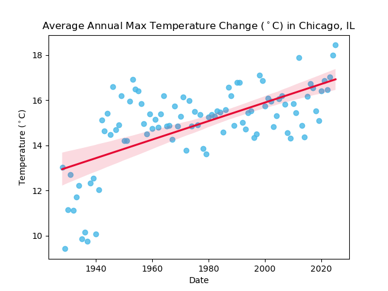

**Hot days in Chicago are getting hotter:** This simple linear regression for a weather station in Chicago, IL shows that daily maximum temperature is increasing at a rate of 0.04° C per year. Data source: [NCEI](https://www.ncdc.noaa.gov/cdo-web/datasets/GHCND/stations/GHCND:USC00111577/detail).
See the code [here](https://natshoff.github.io/portfolioPosts/climateAssignment_hofford.html)!

### Interactive Cahaba Map
<embed type="text/html" src="maps/cahaba.html" width="600" height="600">

**Cahaba River, AL:** The Cahaba River is the longest free-flowing river in Alabama and a part of the Mobile River basin (194 miles / 312 km).

